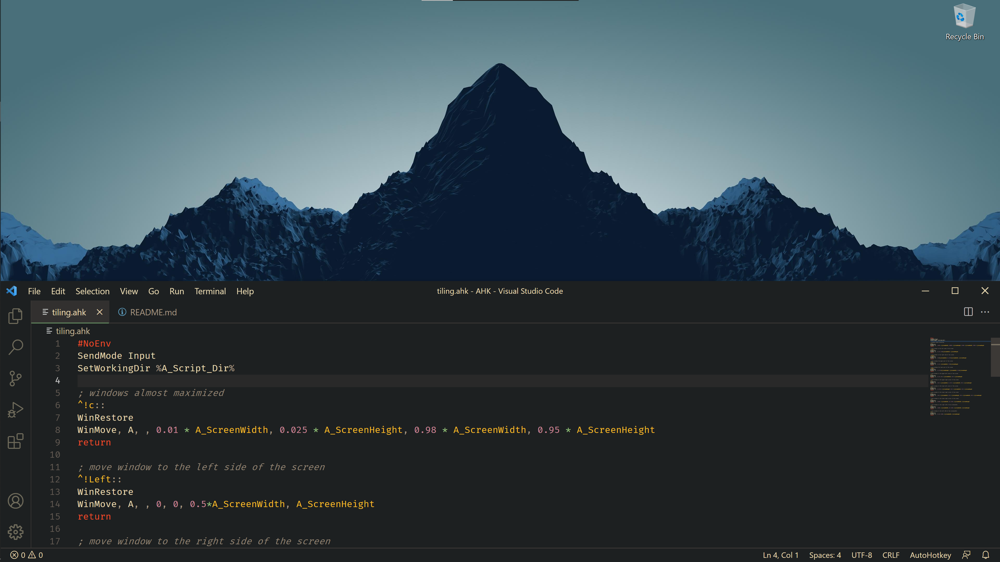
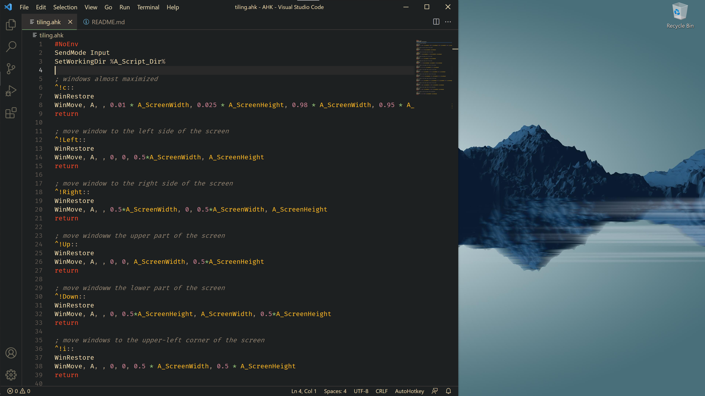

## Some AutoHotKey scripts (at the moment only one)
To use these scripts you have to install [AutoHotKey](https://www.autohotkey.com/). Afterward, you only need to double click on the `.ahk` file and you are ready to go.

## `tiling.ahk`
The aim of this script is to mimic some features of a tiling windows manager. With this script activated, you can control the position of your windows with the following shortcuts.

| Syntax      | Description |
| ----------- | ----------- |
| `CTRL + ALT + c`         |            |
| `CTRL + ALT + Left`      |      |
| `CTRL + ALT + Right`     |    |
| `CTRL + ALT + Up`        |          |
| `CTRL + ALT + Down`      |      |
| `CTRL + ALT + i`         |            |
| `CTRL + ALT + o`         |            |
| `CTRL + ALT + l`         |            |
| `CTRL + ALT + k`         |            |
| `CTRL + ALT + p`         |            |
| `CTRL + ALT + u`         |            |

## Known issues
* some Windows/programs (e.g. VSCode) do not respond to the shortcut if they are maximized. The only solution, at the moment, is to unmaximize the Windows before using the shortcut. You can unmaximize the windows with the native Windows shortcut `WIN + Down`.
